# 🛡️ Mobile-First Guardian CI/CD Integration

## Overview

Automated mobile-first compliance checks integrated into your CI/CD pipeline. Blocks deployments with scores below 80/100.

---

## 🚀 Quick Start

### Local Testing

```bash
# Run Guardian scan locally
npm run mobile-guardian-ci

# Run pre-deployment check
npm run pre-deploy
```

### GitHub Actions Setup

1. **Add Secrets to GitHub Repository**
   - Go to: Settings → Secrets and variables → Actions
   - Add the following secrets:
     - `VITE_SUPABASE_URL`: Your Supabase project URL
     - `VITE_SUPABASE_PUBLISHABLE_KEY`: Your Supabase anon key

2. **Workflow automatically runs on:**
   - Push to `main` or `develop` branches
   - Pull requests to `main` or `develop`

3. **What happens:**
   - ✅ Score ≥ 80/100 → Deployment proceeds
   - ❌ Score < 80/100 → Deployment **BLOCKED**

---

## 📊 CI/CD Pipeline Flow

```mermaid
graph LR
    A[Code Push] --> B[Guardian Scan]
    B --> C{Score ≥ 80?}
    C -->|Yes| D[✅ Deploy]
    C -->|No| E[❌ Block]
    E --> F[PR Comment]
    D --> G[Report Artifact]
    F --> G
```



---

## 🔍 What Gets Checked

### Critical Files Scanned:
- `index.html` → Viewport meta tags
- `src/pages/admin/POAForm.tsx` → Form inputs
- `src/components/poa/POAOCRScanner.tsx` → Upload workflow
- `src/components/poa/PDFPreviewDialog.tsx` → PDF preview
- `src/index.css` → Mobile-first CSS

### Mobile-First Rules:
1. **Viewport Meta** (Critical)
   - `user-scalable=no`, `maximum-scale=1.0`, `viewport-fit=cover`

2. **Touch Targets** (High)
   - Minimum 44x44px (iOS) / 48x48px (Android)

3. **Native APIs** (High)
   - `navigator.share()` for mobile sharing
   - No desktop `<a download>` patterns

4. **Image Optimization** (Medium)
   - Lazy loading, WebP support, compression

5. **Form Inputs** (Medium)
   - `inputMode`, `autoCapitalize`, `touch-manipulation`

6. **Performance** (Low)
   - Code splitting, lazy loading

---

## 📝 Example Output

### ✅ Passing Build

```
📱 MOBILE-FIRST GUARDIAN CI/CD REPORT
============================================================

OVERALL SCORE: 92/100
COMPLIANCE: EXCELLENT

SUMMARY: Mobile-first compliance meets all critical requirements

💡 RECOMMENDATIONS:
1. Add PWA manifest for install prompt
2. Implement Service Worker for offline mode

============================================================
✅ DEPLOYMENT APPROVED
Score 92/100 meets minimum threshold (80/100)
============================================================
```

### ❌ Failing Build

```
📱 MOBILE-FIRST GUARDIAN CI/CD REPORT
============================================================

OVERALL SCORE: 68/100
COMPLIANCE: FAIR

🚨 VIOLATIONS FOUND:
  Critical: 2
  High:     3
  Medium:   4

🔴 CRITICAL VIOLATIONS:

1. Viewport Meta Tag (index.html:5)
   Issue: Missing user-scalable=no and viewport-fit=cover
   Fix: <meta name="viewport" content="width=device-width, initial-scale=1.0, maximum-scale=1.0, user-scalable=no, viewport-fit=cover">
   Impact: Users may experience unwanted zoom and incorrect safe area handling

2. Native Share API (src/pages/admin/POAForm.tsx:161)
   Issue: Using desktop download pattern instead of navigator.share()
   Fix: Use navigator.share({ files: [pdfBlob] }) for mobile
   Impact: iOS users cannot download PDFs

============================================================
❌ DEPLOYMENT BLOCKED
Score 68/100 below minimum threshold (80/100)
============================================================
```

---

## 🔧 Configuration

### Adjust Minimum Score

Edit `.github/workflows/mobile-first-guardian.yml`:

```yaml
env:
  MINIMUM_SCORE: 80  # Change this value (0-100)
```

Edit `scripts/mobile-guardian-ci.mjs`:

```javascript
const MINIMUM_SCORE = 80;  // Change this value
```

### Add Files to Scan

Edit `scripts/mobile-guardian-ci.mjs`:

```javascript
const filesToScan = [
  { path: 'index.html', type: 'viewport', content: ... },
  { path: 'your-file.tsx', type: 'custom', content: ... }, // Add here
  // ...
];
```

---

## 📦 Artifacts

Each run produces:
- **mobile-guardian-report.json** → Full JSON report
- **Retention:** 30 days

Download from: Actions → Workflow Run → Artifacts

---

## 🔔 PR Comments

Automatic comments on pull requests include:
- ✅/❌ Status badge
- Overall score and compliance level
- Critical violations with fixes
- Top 5 recommendations
- Link to full report

Example:

```markdown
## ✅ Mobile-First Guardian Report

**Status:** PASSED
**Score:** 92/100
**Compliance Level:** EXCELLENT
**Violations Found:** 3

### Recommendations
- Add PWA manifest for install prompt
- Implement Service Worker for offline mode
- Optimize multi-POA tabs for small screens

[View full report in artifacts](...)
```

---

## 🚫 Bypassing Checks (Not Recommended)

### Emergency Override

If you must deploy despite failing checks:

```bash
# Local override (testing only)
SKIP_GUARDIAN=1 npm run build

# GitHub: Add [skip-guardian] to commit message
git commit -m "Emergency fix [skip-guardian]"
```

**⚠️ WARNING:** Only use in true emergencies. Document reason.

---

## 🧪 Testing Locally

### Run Full CI Pipeline Locally

```bash
# 1. Install dependencies
npm ci

# 2. Set environment variables
export VITE_SUPABASE_URL="your-url"
export VITE_SUPABASE_PUBLISHABLE_KEY="your-key"

# 3. Run Guardian scan
npm run mobile-guardian-ci

# 4. Check exit code
echo $?  # 0 = passed, 1 = failed
```

### Generate Report Only (No Exit)

```javascript
// Add to mobile-guardian-ci.mjs
process.exit(0);  // Force success for testing
```

---

## 📈 Improving Your Score

### Quick Wins (Easy Fixes)

1. **Update Viewport Meta** (+15 points)
   ```html
   <meta name="viewport" content="width=device-width, initial-scale=1.0, maximum-scale=1.0, user-scalable=no, viewport-fit=cover">
   ```

2. **Add Touch Targets** (+10 points)
   ```tsx
   className="min-h-[44px] touch-manipulation"
   ```

3. **Use Native Share** (+15 points)
   ```typescript
   if (navigator.share) {
     await navigator.share({ files: [blob] });
   }
   ```

### Medium Effort

4. **Image Compression** (+8 points)
   - Add client-side compression before upload
   - Implement lazy loading

5. **EXIF Rotation** (+7 points)
   - Auto-correct photo orientation

### Advanced

6. **PWA Manifest** (+5 points)
   - Add offline support
   - Enable install prompt

---

## 🐛 Troubleshooting

### "Guardian scan failed"

**Cause:** Edge function not deployed or credentials missing

**Fix:**
```bash
# Check secrets are set
echo $VITE_SUPABASE_URL
echo $VITE_SUPABASE_PUBLISHABLE_KEY

# Verify edge function deployed
# Visit: /mobile-guardian in browser
```

### "Cannot read property 'overallScore'"

**Cause:** Invalid response from Guardian API

**Fix:**
- Check `mobile-first-guardian` edge function logs
- Verify LOVABLE_API_KEY is set
- Test locally: `npm run mobile-guardian-ci`

### "Permission denied: scripts/pre-deploy-check.sh"

**Fix:**
```bash
chmod +x scripts/pre-deploy-check.sh
git add scripts/pre-deploy-check.sh
git commit -m "Fix script permissions"
```

---

## 📚 Additional Resources

- [Mobile-First Guardian Dashboard](/mobile-guardian)
- [Phase B Verification Results](MOBILE_FIRST_PHASE_B_VERIFICATION.md)
- [Original Analysis](MOBILE_FIRST_ANALYSIS_A.md)

---

## 🤝 Support

Issues with CI/CD integration? Check:
1. GitHub Actions logs
2. Supabase edge function logs (`mobile-first-guardian`)
3. Local test: `npm run mobile-guardian-ci`

---

**Last Updated:** 2025-11-09
**Minimum Score:** 80/100
**Pipeline Version:** 1.0
