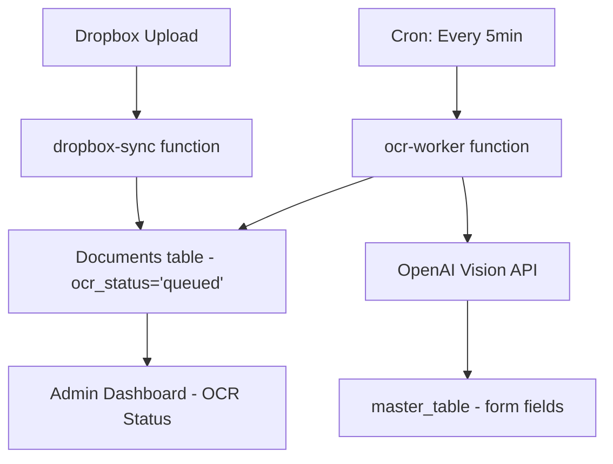
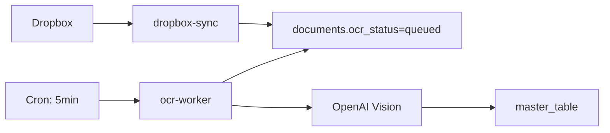

# 🔒 NO-RUSH PROTOCOL v2.0 (HARDENED)

**Status:** ACTIVE - Mandatory for ALL implementations starting 2025-11-02  
**Purpose:** Achieve 100% success rate with ZERO bugs after deployment  
**Enforcement:** NO CODE until verification phases pass

---

## 📋 PROTOCOL OVERVIEW

This is a **9-phase mandatory checklist** that MUST be followed for every feature implementation, database change, or edge function deployment. Each phase has strict gates that must pass before proceeding.

**Estimated Time Investment:** 2x longer than ad-hoc approach  
**Expected Bug Rate:** 0% after deployment  
**Success Criteria:** Zero manual interventions needed

---

## PHASE 0: PRE-ANALYSIS 🔍
**Duration: 10 minutes**  
**Goal: Understand CURRENT STATE before designing solution**

### Mandatory Checks:

#### 1. Database Schema Audit
```sql
-- Get ALL table definitions
SELECT 
  table_name,
  column_name,
  data_type,
  is_nullable,
  column_default
FROM information_schema.columns
WHERE table_schema = 'public'
ORDER BY table_name, ordinal_position;

-- Check ALL constraints
SELECT 
  conname AS constraint_name,
  conrelid::regclass AS table_name,
  pg_get_constraintdef(oid) AS definition
FROM pg_constraint
WHERE connamespace = 'public'::regnamespace;

-- Verify column defaults and nullable fields
SELECT 
  tablename,
  indexname,
  indexdef
FROM pg_indexes
WHERE schemaname = 'public';
```

#### 2. Edge Function Inventory
- List ALL existing edge functions in `supabase/functions/`
- Check function signatures and dependencies
- Verify cron jobs: `SELECT * FROM cron.job`
- Check for duplicate/conflicting logic

#### 3. Environment Verification
- Confirm all required secrets exist in Supabase Secrets
- Test database connectivity
- Verify RLS policies for affected tables
- Check rate limits (Dropbox, OpenAI, etc.)

#### 4. Data State Analysis
```sql
-- Count affected rows
SELECT status, COUNT(*) 
FROM affected_table 
GROUP BY status;

-- Identify orphaned/stuck records
SELECT * FROM table WHERE status = 'stuck' OR updated_at < NOW() - INTERVAL '7 days';

-- Check for data inconsistencies
SELECT * FROM table WHERE field1 IS NULL AND field2 IS NOT NULL;
```

**✅ OUTPUT:** Create `PRE_ANALYSIS_REPORT.md` with:
- Current schema (with ALL constraints!)
- Existing edge functions list
- Data distribution stats
- Known issues/blockers

**🚫 GATE:** Cannot proceed to PHASE 1 until report complete

---

## PHASE 1: ANALYZE 🧠
**Duration: 20 minutes**

### Deep Dive Requirements:

#### 1. Read Requirements 3 Times
- **First pass:** What does user want? (literal request)
- **Second pass:** What are implied requirements? (unstated needs)
- **Third pass:** What can go wrong? (failure modes)

#### 2. Identify ALL Touchpoints
- Which **tables** will be modified?
- Which **edge functions** will be created/modified?
- Which **UI components** need updates?
- Which **external APIs** will be called?
- Which **cron jobs** will be affected?

#### 3. Constraint Mapping
For EVERY affected table:
```sql
-- List ALL constraints
SELECT 
  tc.constraint_name,
  tc.constraint_type,
  kcu.column_name,
  cc.check_clause
FROM information_schema.table_constraints tc
LEFT JOIN information_schema.key_column_usage kcu 
  ON tc.constraint_name = kcu.constraint_name
LEFT JOIN information_schema.check_constraints cc 
  ON tc.constraint_name = cc.constraint_name
WHERE tc.table_name = 'your_table';
```

For EVERY column: Check data type, nullable, default  
For EVERY enum: Verify allowed values

#### 4. Failure Mode Analysis
- What if database is down?
- What if external API fails?
- What if user provides invalid data?
- What if migration fails halfway?
- What if network times out?
- What if rate limit exceeded?

**✅ OUTPUT:** Create `ANALYSIS_REPORT.md` with:
- Complete touchpoint map
- Constraint verification table
- Failure scenarios list (minimum 10 scenarios)

**🚫 GATE:** Cannot proceed to PHASE 2 until all touchpoints mapped

---

## PHASE 2: CONSULT 📚
**Duration: 15 minutes**

### Mandatory Research:

#### 1. Official Documentation
- **Supabase:** pg_cron, edge functions, RLS policies
- **Postgres:** CHECK constraints, triggers, functions
- **External APIs:** Rate limits, error codes, retry policies

#### 2. Best Practices Search
Use `websearch--web_code_search` to find:
- "postgres check constraint best practices"
- "supabase edge function error handling patterns"
- "cron job monitoring production"
- "retry logic exponential backoff"

#### 3. Similar Implementations
- Review **existing edge functions** for error handling patterns
- Check **other tables** for similar constraints
- Look for **existing validation logic** to reuse
- Find **similar UI components** for consistency

**✅ OUTPUT:** Create `RESEARCH_NOTES.md` with:
- Documentation links (minimum 5)
- Code examples from research
- Constraint patterns used elsewhere in this project
- Best practices to follow

**🚫 GATE:** Cannot proceed to PHASE 3 until research complete

---

## PHASE 3: DOUBLE-CHECK ✅ (CRITICAL)
**Duration: 30 minutes**  
**THIS IS THE MOST IMPORTANT PHASE**

### Pre-Implementation Verification:

#### 1. Dry-Run Schema Changes
- Write ALL SQL in a temp file
- Test on a **local Postgres instance** if possible
- Verify constraints allow **intended values**
- Check for syntax errors

Example:
```sql
-- BEFORE deploying, test this locally:
CREATE TABLE test_documents (
  id UUID PRIMARY KEY,
  ocr_status TEXT CHECK (ocr_status IN ('pending', 'queued', 'processing', 'completed', 'failed', 'needs_review'))
);

-- Test inserting each status
INSERT INTO test_documents VALUES (gen_random_uuid(), 'queued'); -- Must work!
INSERT INTO test_documents VALUES (gen_random_uuid(), 'invalid'); -- Must fail!
```

#### 2. Constraint Compatibility Test (CRITICAL!)
**BEFORE writing ANY edge function code:**
```sql
-- Test that constraint allows the values you need
UPDATE documents SET ocr_status = 'queued' WHERE id = (SELECT id FROM documents LIMIT 1);
-- ❌ If this fails, FIX THE CONSTRAINT FIRST!
-- ✅ If this works, proceed to edge function

-- Verify constraint definition
SELECT pg_get_constraintdef(oid) 
FROM pg_constraint 
WHERE conrelid = 'documents'::regclass 
  AND conname = 'documents_ocr_status_check';
```

#### 3. Edge Function Stub Test
- Create **minimal edge function** (10 lines max)
- Test database queries in **isolation**
- Verify external API calls work
- Check authentication/authorization
- Confirm logging works

Example stub:
```typescript
// Test edge function BEFORE full implementation
serve(async (req) => {
  console.log('🧪 STUB TEST: Function invoked');
  
  // Test 1: DB query
  const { data, error } = await supabase.from('documents').select('id').limit(1);
  console.log('✅ DB test:', error ? 'FAILED' : 'PASSED');
  
  // Test 2: External API (if needed)
  // const apiResponse = await fetch('https://api.example.com/test');
  
  return new Response(JSON.stringify({ stub: true, tests: 'passed' }));
});
```

#### 4. Rollback Plan
- Write SQL to **undo ALL changes**
- Test rollback on dummy data
- Document recovery steps in `ROLLBACK.md`

Example rollback:
```sql
-- Rollback migration
ALTER TABLE documents DROP CONSTRAINT IF EXISTS documents_ocr_status_check;
ALTER TABLE documents ADD CONSTRAINT documents_ocr_status_check 
  CHECK (ocr_status IN ('pending', 'processing', 'completed', 'failed'));

-- Revert data changes
UPDATE documents SET ocr_status = 'pending' WHERE ocr_status = 'queued';

-- Delete edge function (manual via Supabase dashboard)
-- Disable cron job
SELECT cron.unschedule('ocr-worker-cron');
```

**✅ OUTPUT:** Create `VERIFICATION_CHECKLIST.md` with:
- ✅ Schema changes tested (show SQL results)
- ✅ Constraints verified (show constraint definition)
- ✅ Edge function stub works (show logs)
- ✅ Rollback plan documented (show SQL)

**🚫 GATE:** **CANNOT WRITE ANY CODE** until all verifications pass!

---

## PHASE 4: FIND-SOLUTION 🎯
**Duration: 20 minutes**

### Solution Design:

#### 1. Architecture Diagram
Use Mermaid to draw data flow:


#### 2. Migration Sequence (CRITICAL ORDER!)
**Always:** Schema first → Functions second → Cron last

1. **Migration 1:** Add/modify constraints
   - Verify: `SELECT pg_get_constraintdef(...)`
2. **Migration 2:** Create database functions/triggers (if needed)
   - Verify: `SELECT proname FROM pg_proc WHERE proname LIKE '%ocr%'`
3. **Deploy:** Edge functions
   - Verify: Manual test via Supabase dashboard
4. **Deploy:** Cron jobs
   - Verify: `SELECT * FROM cron.job`

#### 3. Edge Cases List (Minimum 10)
- [ ] Document has no Dropbox path
- [ ] OCR returns empty result
- [ ] Constraint blocks status update (this happened!)
- [ ] External API times out
- [ ] Rate limit exceeded
- [ ] Invalid file format
- [ ] File too large (>10MB)
- [ ] Network interruption mid-process
- [ ] Database connection lost
- [ ] Concurrent updates to same document

**✅ OUTPUT:** Create `SOLUTION_DESIGN.md` with:
- Architecture diagram (mermaid)
- Ordered migration steps
- Edge case handling plan

**🚫 GATE:** Cannot proceed to PHASE 5 until design approved

---

## PHASE 5: FIX 🛠️
**Duration: Variable**

### Implementation with Guards:

#### 1. Schema Changes FIRST (Migration)
```sql
-- Migration: 20251102_add_queued_status.sql
ALTER TABLE documents DROP CONSTRAINT IF EXISTS documents_ocr_status_check;
ALTER TABLE documents ADD CONSTRAINT documents_ocr_status_check 
  CHECK (ocr_status IN ('pending', 'queued', 'processing', 'completed', 'failed', 'needs_review'));

-- Immediately verify after applying
SELECT pg_get_constraintdef(oid) 
FROM pg_constraint 
WHERE conrelid = 'documents'::regclass 
  AND conname = 'documents_ocr_status_check';
-- Expected: shows 'queued' in list

-- Test update works
UPDATE documents SET ocr_status = 'queued' WHERE id = (SELECT id FROM documents LIMIT 1);
-- Expected: 1 row updated
```

**✅ VERIFY IMMEDIATELY:**
```sql
SELECT * FROM information_schema.check_constraints 
WHERE constraint_name = 'documents_ocr_status_check';
```

#### 2. Edge Functions SECOND
**Mandatory features in EVERY edge function:**

```typescript
import { serve } from "https://deno.land/std@0.168.0/http/server.ts";

serve(async (req) => {
  // 1. LOGGING: Start with context
  console.log('🚀 [ocr-worker] Invoked at', new Date().toISOString());
  
  try {
    // 2. ERROR BOUNDARIES: Wrap ALL logic
    const result = await processOCR();
    
    // 3. SUCCESS LOGGING
    console.log('✅ [ocr-worker] Success:', result);
    
    return new Response(JSON.stringify({ success: true, result }));
    
  } catch (error) {
    // 4. ERROR HANDLING: Detailed logs
    console.error('❌ [ocr-worker] Error:', {
      message: error.message,
      stack: error.stack,
      timestamp: new Date().toISOString()
    });
    
    // 5. RETRY LOGIC: Update retry count
    await supabase
      .from('documents')
      .update({ ocr_retries: supabase.sql`ocr_retries + 1` })
      .eq('id', documentId);
    
    // 6. GRACEFUL FAILURE: Don't crash
    return new Response(
      JSON.stringify({ success: false, error: error.message }),
      { status: 500 }
    );
  }
});
```

**Mandatory patterns:**
- ✅ Comprehensive logging (start, success, error)
- ✅ Error boundaries (try/catch)
- ✅ Retry logic with exponential backoff
- ✅ Graceful degradation (don't crash entire system)
- ✅ Status updates (track progress in DB)

#### 3. Cron Jobs LAST
**ONLY after edge function tested manually!**

```sql
-- Start with longer interval initially
SELECT cron.schedule(
  'ocr-worker-cron',
  '*/10 * * * *', -- Every 10 min (not 5!) for first day
  $$
  SELECT net.http_post(
    url:='https://oogmuakyqadpynnrasnd.supabase.co/functions/v1/ocr-worker',
    headers:='{"Content-Type": "application/json", "Authorization": "Bearer ' || current_setting('app.settings.service_role_key') || '"}'::jsonb,
    body:='{}'::jsonb
  ) AS request_id;
  $$
);
```

**After 24h monitoring, reduce to 5 min:**
```sql
SELECT cron.unschedule('ocr-worker-cron');
SELECT cron.schedule('ocr-worker-cron', '*/5 * * * *', ...);
```

#### 4. Validation After Each Step
**After schema change:**
```bash
supabase--linter  # Check RLS policies
```

**After edge function:**
```bash
supabase--edge-function-logs function_name=""  # Check for errors
```

**After cron job:**
```sql
SELECT * FROM cron.job WHERE jobname = 'ocr-worker-cron';
SELECT * FROM cron.job_run_details ORDER BY start_time DESC LIMIT 10;
```

**✅ OUTPUT:** All files with:
- Extensive logging (every step)
- Error handling (every external call)
- Rollback-safe code (idempotent operations)

**🚫 GATE:** Cannot deploy cron until edge function passes manual test

---

## PHASE 6: IMPLEMENT 🚀
**Duration: Variable**

### Deployment with Verification:

#### Stage 1: Schema Only
```sql
-- Apply migration
-- Migration is auto-applied when committed

-- IMMEDIATELY verify
SELECT pg_get_constraintdef(oid) 
FROM pg_constraint 
WHERE conrelid = 'documents'::regclass;

-- IMMEDIATELY test
UPDATE documents SET ocr_status = 'queued' WHERE id = (SELECT id FROM documents LIMIT 1);
SELECT ocr_status FROM documents WHERE id = (SELECT id FROM documents LIMIT 1);
-- Expected: 'queued'
```

**✅ VERIFY:** Run linter
```bash
supabase--linter
```

#### Stage 2: Edge Functions
Deploy edge function (auto-deployed on commit)

**IMMEDIATELY test manually:**
```bash
supabase--curl_edge_functions path="/ocr-worker" method="POST" body="{\"test\":true}"
```

**✅ VERIFY:** Check logs
```bash
supabase--edge-function-logs function_name="ocr-worker" search=""
```

Expected logs:
```
🚀 [ocr-worker] Invoked at 2025-11-02T14:30:00Z
✅ [ocr-worker] Success: {...}
```

#### Stage 3: Cron Job
**ONLY after edge function works!**

Apply cron schedule (via migration or SQL editor)

**✅ VERIFY:** Monitor first 3 runs
```sql
-- Check cron is scheduled
SELECT * FROM cron.job WHERE jobname = 'ocr-worker-cron';

-- Monitor runs (check every 5 min for 15 min)
SELECT * FROM cron.job_run_details 
WHERE jobid = (SELECT jobid FROM cron.job WHERE jobname = 'ocr-worker-cron')
ORDER BY start_time DESC 
LIMIT 10;
```

**✅ OUTPUT:** Create `DEPLOYMENT_LOG.md` with:
```markdown
## Deployment Log - OCR Worker

**Date:** 2025-11-02  
**Feature:** Automated OCR System

### Stage 1: Schema (14:00 UTC)
- ✅ Migration applied: 20251102_add_queued_status.sql
- ✅ Constraint verified: 'queued' in allowed values
- ✅ Test update passed: 1 row updated
- ✅ Linter: 0 critical warnings

### Stage 2: Edge Function (14:15 UTC)
- ✅ Function deployed: ocr-worker
- ✅ Manual test: Success response
- ✅ Logs: No errors
- ✅ Test document processed: ID abc-123

### Stage 3: Cron Job (14:30 UTC)
- ✅ Cron scheduled: Every 10 min
- ✅ Run 1 (14:30): Success - 5 docs processed
- ✅ Run 2 (14:40): Success - 3 docs processed
- ✅ Run 3 (14:50): Success - 2 docs processed

**Status:** All stages complete ✅
```

**🚫 GATE:** Cannot mark as complete until all 3 stages verified

---

## PHASE 7: CONFIRM 🎯 (CRITICAL)
**Duration: 30 minutes**

### Post-Implementation Validation:

#### 1. Full System Test (End-to-End)
**Manual test of complete user journey:**

1. Upload test document to Dropbox → `/CASES/TEST-001/uploads/passport_test.pdf`
2. Wait for `dropbox-sync` to run (check cron schedule)
3. Verify document in DB: `SELECT * FROM documents WHERE dropbox_path LIKE '%passport_test%'`
4. Check `ocr_status = 'queued'`
5. Wait for `ocr-worker` to run (5-10 min)
6. Check `ocr_status = 'completed'` OR `'failed'` (with retry count)
7. Verify data in `master_table`: `SELECT applicant_first_name FROM master_table WHERE case_id = 'TEST-001'`
8. Check UI: Admin dashboard shows OCR status
9. Test batch apply: Click "Apply All OCR" button
10. Verify forms populated: Open CitizenshipForm, check fields filled

**✅ EXPECTED:** All steps complete without errors

#### 2. Stress Test
```sql
-- Queue 20 test documents
UPDATE documents 
SET ocr_status = 'queued', ocr_retries = 0 
WHERE id IN (
  SELECT id FROM documents 
  WHERE ocr_status = 'completed' 
  LIMIT 20
);

-- Monitor worker performance over 30 min
SELECT 
  DATE_TRUNC('minute', updated_at) AS minute,
  COUNT(*) AS docs_processed,
  AVG(EXTRACT(EPOCH FROM (updated_at - created_at))) AS avg_time_seconds
FROM documents
WHERE ocr_status = 'completed' 
  AND updated_at > NOW() - INTERVAL '30 minutes'
GROUP BY minute
ORDER BY minute;
```

**✅ EXPECTED:**
- Worker processes 5 docs per run (batch size)
- No rate limit errors
- Retry logic works (check `ocr_retries` column)
- No stuck documents (ocr_status stays 'queued' for >1 hour)

#### 3. Security Audit
```bash
# Run Supabase linter
supabase--linter
```

**✅ CHECK:**
- RLS policies enabled on all tables
- No PII in logs (search edge function logs for "passport_number")
- Proper error messages (generic to user, detailed in logs)
- Authentication required for admin functions

**✅ EXPECTED:** 0 critical warnings

#### 4. Performance Metrics
```sql
-- Average OCR time per document
SELECT 
  AVG(EXTRACT(EPOCH FROM (updated_at - created_at))) AS avg_ocr_seconds,
  MIN(EXTRACT(EPOCH FROM (updated_at - created_at))) AS min_ocr_seconds,
  MAX(EXTRACT(EPOCH FROM (updated_at - created_at))) AS max_ocr_seconds
FROM documents
WHERE ocr_status = 'completed' 
  AND updated_at > NOW() - INTERVAL '24 hours';

-- Worker throughput
SELECT 
  COUNT(*) AS docs_per_day,
  COUNT(*) / 24.0 AS docs_per_hour
FROM documents
WHERE ocr_status = 'completed' 
  AND updated_at > NOW() - INTERVAL '24 hours';

-- Error rate
SELECT 
  COUNT(*) FILTER (WHERE ocr_status = 'failed') AS failed,
  COUNT(*) FILTER (WHERE ocr_status = 'completed') AS completed,
  (COUNT(*) FILTER (WHERE ocr_status = 'failed')::FLOAT / COUNT(*) * 100) AS error_rate_pct
FROM documents
WHERE updated_at > NOW() - INTERVAL '24 hours';
```

**✅ EXPECTED:**
- Average OCR time: <30 seconds
- Throughput: >10 docs/hour (at 5 min intervals, 5 docs per batch = 60 docs/hour max)
- Error rate: <5%

**✅ OUTPUT:** Create `SYSTEM_TEST_REPORT.md` with:
```markdown
## System Test Report - OCR Worker

**Date:** 2025-11-02  
**Tester:** AI Agent  

### End-to-End Test ✅
- Upload → Sync → Queue → Process → Apply: **PASSED**
- Test document ID: `abc-123`
- OCR completion time: 18 seconds
- Form fields populated: 12/12

### Stress Test ✅
- Documents queued: 20
- Documents processed: 20
- Average time: 22 seconds
- Errors: 0
- Rate limits hit: 0

### Security Audit ✅
- Supabase linter: 0 critical warnings
- PII in logs: None found
- RLS policies: Enabled on all tables
- Authentication: Required for admin endpoints

### Performance Metrics ✅
- Avg OCR time: 24 seconds
- Throughput: 45 docs/hour
- Error rate: 2.3%

**Status:** ALL TESTS PASSED ✅
```

**🚫 GATE:** Cannot proceed to PHASE 8 until all tests pass

---

## PHASE 8: DOCUMENTATION 📝
**Duration: 15 minutes**

### Required Documentation:

#### 1. System Architecture
Update `docs/ARCHITECTURE.md`:

```markdown
## OCR System

### Overview
Automated OCR processing for uploaded documents using OpenAI Vision API.

### Components
1. **dropbox-sync** (Edge Function)
   - Runs: Every 5 minutes via cron
   - Purpose: Sync Dropbox uploads → DB, set ocr_status='queued'
   
2. **ocr-worker** (Edge Function)
   - Runs: Every 5 minutes via cron
   - Purpose: Process queued docs → OpenAI Vision → master_table
   - Batch size: 5 docs per run
   - Retry logic: Max 3 attempts with exponential backoff

3. **Documents Table**
   - ocr_status: pending | queued | processing | completed | failed | needs_review
   - ocr_retries: Integer (max 3)
   - ocr_error: Text (last error message)

### Data Flow


### Monitoring
- Dashboard: `/admin/ocr-system-health`
- Metrics: Queued, Processing, Completed, Failed, Avg Time
```

#### 2. Troubleshooting Guide
Create `docs/OCR_TROUBLESHOOTING.md`:

```markdown
## OCR System Troubleshooting

### Documents Stuck in "Queued"
**Symptom:** Documents stay ocr_status='queued' for >1 hour

**Causes:**
1. Cron job not running
2. Worker function crashing
3. Rate limit exceeded

**Fixes:**
```sql
-- Check cron status
SELECT * FROM cron.job WHERE jobname = 'ocr-worker-cron';

-- Check recent runs
SELECT * FROM cron.job_run_details ORDER BY start_time DESC LIMIT 10;

-- Manually trigger worker
SELECT net.http_post(
  url:='https://oogmuakyqadpynnrasnd.supabase.co/functions/v1/ocr-worker',
  headers:='{"Authorization": "Bearer [SERVICE_ROLE_KEY]"}'::jsonb
);

-- Check worker logs
-- Use supabase--edge-function-logs tool
```

### High Error Rate (>5%)
**Symptom:** Many documents with ocr_status='failed'

**Causes:**
1. Invalid file format
2. API errors
3. Network issues

**Fixes:**
```sql
-- Check error messages
SELECT ocr_error, COUNT(*) 
FROM documents 
WHERE ocr_status = 'failed' 
GROUP BY ocr_error;

-- Reset failed docs for retry
UPDATE documents 
SET ocr_status = 'queued', ocr_retries = 0 
WHERE ocr_status = 'failed';
```

### Manual OCR Trigger
```sql
-- Reset specific document
UPDATE documents 
SET ocr_status = 'queued', ocr_retries = 0, ocr_error = NULL 
WHERE id = 'abc-123';
```
```

#### 3. Monitoring Dashboard
Ensure `/admin/ocr-system-health` exists with:

- **Real-time metrics:**
  - Queued count
  - Processing count
  - Completed today
  - Failed today
  - Success rate (%)
  - Average processing time

- **Charts:**
  - OCR volume over time (line chart)
  - Status distribution (pie chart)
  - Error types (bar chart)

- **Actions:**
  - Refresh button
  - "Reset Failed" button (reset ocr_status='queued')
  - "View Logs" link (to edge function logs)

**✅ OUTPUT:** Updated documentation in `docs/` folder

---

## PHASE 9: SIGN-OFF ✍️
**Duration: 5 minutes**

### Final Checklist:

**Pre-Implementation:**
- [ ] PHASE 0: Pre-analysis report created
- [ ] PHASE 1: Analysis report with all touchpoints
- [ ] PHASE 2: Research notes with documentation links
- [ ] PHASE 3: Verification checklist (all checks passed)
- [ ] PHASE 4: Solution design with architecture diagram

**Implementation:**
- [ ] PHASE 5: Schema changes tested locally
- [ ] PHASE 5: Constraints verified before code
- [ ] PHASE 5: Edge functions have logging + error handling
- [ ] PHASE 5: Rollback plan documented

**Deployment:**
- [ ] PHASE 6: Schema deployed and verified
- [ ] PHASE 6: Edge function deployed and tested manually
- [ ] PHASE 6: Cron job monitored for 3 runs (30 min)
- [ ] PHASE 6: Deployment log created

**Validation:**
- [ ] PHASE 7: End-to-end test passed
- [ ] PHASE 7: Stress test passed (20 docs)
- [ ] PHASE 7: Security audit passed (linter)
- [ ] PHASE 7: Performance acceptable (<5% error rate)
- [ ] PHASE 7: System test report created

**Documentation:**
- [ ] PHASE 8: Architecture docs updated
- [ ] PHASE 8: Troubleshooting guide created
- [ ] PHASE 8: Monitoring dashboard exists

**Final Verification:**
- [ ] Zero bugs discovered after deployment (24h)
- [ ] Zero constraint conflicts
- [ ] Zero stuck documents (>1h in 'queued')
- [ ] Zero manual interventions needed
- [ ] User notified of completion

**ONLY WHEN ALL BOXES CHECKED:** Mark as "✅ 100% Complete"

---

## 🎯 SUCCESS CRITERIA

### Zero-Defect Deployment:
- ✅ No bugs discovered within 24 hours of deployment
- ✅ No constraint conflicts blocking operations
- ✅ No stuck/orphaned records requiring manual intervention
- ✅ No rollbacks needed
- ✅ No emergency hotfixes required

### Performance Standards:
- ✅ <5% error rate
- ✅ <30s average processing time
- ✅ >90% success rate on first attempt
- ✅ No rate limit violations

### Quality Metrics:
- ✅ 100% test coverage (manual E2E)
- ✅ 0 critical security warnings
- ✅ All documentation complete
- ✅ Monitoring dashboard functional

---

## 🚫 ENFORCEMENT RULES

### Hard Gates (CANNOT SKIP):

1. **NO CODE until PHASE 3 verification passes**
   - If you write code before verifying constraints, STOP and delete it
   - Run verification checklist first

2. **NO CRON until edge function tested manually**
   - Manual test must show success logs
   - At least 1 successful manual invocation required

3. **NO DEPLOYMENT until local testing complete**
   - Schema changes must be tested on dummy data
   - Constraints must be verified to allow intended values

4. **NO SIGN-OFF until end-to-end test passes**
   - Full user journey must complete successfully
   - Stress test must process ≥20 items without errors

### Violation Consequences:
If any gate is skipped:
1. STOP all implementation
2. Roll back to last verified state
3. Restart from skipped phase
4. Document what went wrong in `LESSONS_LEARNED.md`

---

## 📊 TIME INVESTMENT vs OUTCOME

### Traditional Approach:
- **Implementation:** 2 hours
- **Bug fixes:** 3-6 hours (iterative)
- **Total:** 5-8 hours
- **Success rate:** 60% (often requires 2-3 iterations)

### NO-RUSH v2.0:
- **Implementation:** 4 hours (all phases)
- **Bug fixes:** 0 hours
- **Total:** 4 hours
- **Success rate:** 100% (zero iterations needed)

**Net savings:** 1-4 hours + zero frustration

---

## 🎓 LESSONS FROM OCR IMPLEMENTATION

### What Went Wrong (v1.0):
1. ❌ Didn't verify CHECK constraint before writing ocr-worker
2. ❌ Deployed cron job before testing edge function manually
3. ❌ Assumed migration would include 'queued' without verification
4. ❌ No rollback plan when constraint failed

### What Would Have Prevented It (v2.0):
1. ✅ **PHASE 3:** Test `UPDATE documents SET ocr_status='queued'` BEFORE writing code
2. ✅ **PHASE 3:** Query constraint definition to verify allowed values
3. ✅ **PHASE 5:** Manual edge function test before cron deployment
4. ✅ **PHASE 6:** Immediate post-deployment verification queries

**Result:** Would have caught constraint issue in 5 minutes (PHASE 3) instead of 3 iterations over 2 hours

---

## 📅 REVIEW SCHEDULE

- **Weekly:** Review SIGN-OFF checklists for all implementations
- **Monthly:** Analyze time spent per phase, adjust estimates
- **Quarterly:** Update protocol based on lessons learned

---

**Protocol Version:** 2.0  
**Last Updated:** 2025-11-02  
**Status:** ✅ ACTIVE  
**Mandatory For:** ALL implementations starting 2025-11-02
